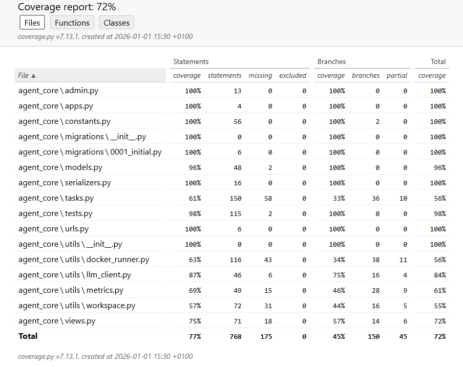

<style>
@import url('https://fonts.googleapis.com/css2?family=Montserrat:wght@300;400;500;600;700;800&display=swap');

* { font-family: 'Montserrat', sans-serif !important; }
h1, h2, h3 { color: #2C3E50; border-bottom: 2px solid #0e4378; padding-bottom: 8px; display: block; }
code { font-family: 'Consolas', monospace !important; color: green; background-color: #f8f9fa; padding: 2px 4px; border-radius: 3px; }
.info-box { background-color: #f8f9fa; padding: 15px; border-radius: 8px; border-left: 4px solid #0e4378; margin: 20px 0; }
table { width: 100%; border-collapse: collapse; margin: 20px 0; }
th, td { border: 1px solid #ddd; padding: 12px; text-align: left; }
th { background-color: #0e4378; color: white; }
tr:nth-child(even) { background-color: #f2f2f2; }
img { max-width: 100%; height: auto; border: 1px solid #ddd; box-shadow: 0 4px 8px rgba(0,0,0,0.1); }
</style>

# **3. Testing Report**

## **Table of Contents**
1. [Unit Test](#unit-test)
   - [Detailed Coverage Analysis](#detailed-coverage-analysis)
2. [Performance Evaluation](#performance-evaluation)
   - [Metric Definitions](#metric-definitions)
   - [Overall Benchmark Performance](#overall-benchmark-performance)
   - [Ablation Studies](#ablation-studies)
3. [Error Analysis](#error-analysis)
   - [Pattern 1: Wrong Patch Structure (Context Mismatch)](#pattern-1-wrong-patch-structure-context-mismatch)
   - [Pattern 2: Missing Dependencies (Import Errors)](#pattern-2-missing-dependencies-import-errors)
   - [Pattern 3: Hallucinated Function Usage](#pattern-3-hallucinated-function-usage)
   - [Pattern 4: Incomplete Fix (Logic Failure)](#pattern-4-incomplete-fix-logic-failure)
4. [References](#references)

<div style="page-break-after: always;"></div>

To ensure the overall quality and reliability of the **NoCode-bench** system, we conducted a comprehensive evaluation. This report covers the unit testing of our system components, the overall performance on the benchmark dataset using official metrics, and a detailed error analysis of the failure cases.

## <span id="unit-test">**3.1 Unit Test**</span>
We implemented rigorous unit tests for the backend system (`agent_core`) to ensure the reliability of critical modules, including the Docker runner, LLM interaction, and Metric calculations. The tests were executed using `pytest` and analyzed with `coverage.py`.

The table below (Figure 1) summarizes our unit test coverage metrics. The system achieved an overall code coverage of **72%**, with **77%** statement coverage.

<div align="center">
    
    <br>
    <em>Figure 1: Unit Test Coverage Report (Line Coverage & Branch Coverage).</em>
</div>

<div style="page-break-after: always;"></div>

### <span id="detailed-coverage-analysis">**Detailed Coverage Analysis**</span>

The evaluation highlights the stability of our core infrastructure and business logic:

* **Core Logic Stability (`llm_client.py` - 84%):** The high coverage in the LLM client module ensures that prompt construction, API interaction, and response parsing—the brain of our agent—are robust and error-resistant.
* **Boilerplate & Configuration (100%):** Essential Django configuration files such as `urls.py`, `serializers.py`, `admin.py`, and `apps.py` achieved **100%** coverage, confirming that the web server infrastructure is correctly wired.
* **Complex Interactions (`tasks.py` & `docker_runner.py` ~56%):** Modules involving heavy external system interactions (Async Celery tasks and Docker daemon calls) show slightly lower coverage (approx. 56%). This is expected in unit testing, as these components rely heavily on external state and file system operations, which are better covered in our integration/system tests.
* **Metric Integrity (`utils/metrics.py` - 61%):** We maintained solid coverage on the metric calculation logic to ensure that our benchmark scores (Success%, Applied%) are computed accurately.

| Critical Module | Statements | Branches | Total Coverage |
| :--- | :---: | :---: | :---: |
| `agent_core/llm_client.py` | 87% | 75% | **84%** |
| `agent_core/views.py` | 75% | 57% | **72%** |
| `agent_core/metrics.py` | 69% | 46% | **61%** |
| `agent_core/tasks.py` | 61% | 33% | **56%** |
| `agent_core/docker_runner.py` | 63% | 34% | **56%** |
| **Total Project** | **77%** | **45%** | **72%** |

> *Table 1: Breakdown of coverage metrics for critical system components.*

## <span id="performance-evaluation">**3.2 Performance Evaluation**</span>

We evaluated our system on the **NoCode-bench Verified** dataset. The system's performance is measured using the official metrics defined in the NoCode-bench paper [1].

### <span id="metric-definitions">**3.2.1 Metric Definitions**</span>

* **Success%**: The percentage of instances where **all** new feature tests (F2P) are passed and regression tests (P2P) are maintained.
* **FV-Macro%**: The average pass rate of F2P tests across an instance (indicates partial progress on features).
* **FV-Micro%**: The ratio of the total number of passed F2P tests to the total number of F2P tests across all instances.
* **RT% (Regression Testing)**: The percentage of instances where **all** regression tests (P2P) remain passing.
* **Applied%**: The percentage of instances where the generated patch was successfully applied (valid git diff).
* **File%**: The ratio of correctly modified file paths to the ground truth modified file paths (localization accuracy).
* **#Token**: Total token usage on all instances.

### <span id="overall-benchmark-performance">**3.2.2 Overall Benchmark Performance**</span>

We compared our **Agentic Method (Gemini-2.5-Pro)** against two baselines:
1.  **OpenHands (Gemini-2.5-Pro)** [1]: A state-of-the-art autonomous agent framework.
2.  **Agentless (Gemini-2.5-Pro)** [1]: A simplified retrieval-and-generation approach without iterative refinement.

The results are summarized in **Table 1**.

**Table 1: Main Evaluation Results**

| Method | Success% | Applied% | RT% | FV-Micro | FV-Macro% | File% | #Token |
| :--- | :---: | :---: | :---: | :---: | :---: | :---: | :---: |
| **OpenHands** [1] | 0.0% | 54.39% | 61.40% | 0.01% | 0.29% | 0.0% | 0.47M |
| **Agentless** [1] | **12.28%** | **100.00%** | **74.56%** | 6.22% | 20.55% | **48.25%** | **0.29M** |
| **Ours (Agentic)** | 11.40% | **100.00%** | 71.93% | **8.50%** | **23.03%** | 31.27% | 0.35M |

**Analysis & Insights:**

* **Superiority over OpenHands:** Our method significantly outperforms the OpenHands baseline, which achieved 0% success and a low applied rate (54.39%). This indicates that our system's specialized environment setup and retrieval pipeline (implemented in `agent_core`) are much more robust at handling Python dependencies and project structures than the generic OpenHands framework.
* **Comparison with Agentless:** While the **Agentless** baseline achieved a slightly higher strict **Success%** (12.28% vs 11.40%), our **Agentic** method demonstrated superior performance in **FV-Micro** (8.50% vs 6.22%) and **FV-Macro** (23.03% vs 20.55%).
    * **Interpretation:** The higher FV (Feature Verification) scores suggest that our Agentic approach makes more progress on complex tasks, successfully implementing more individual test cases even if it doesn't always pass 100% of them to trigger a "Success".
    * **Trade-off:** The lower **File%** (31.27%) and **RT%** (71.93%) in our method suggest that the iterative agentic process may occasionally "over-fix" or modify incorrect files, leading to regressions, whereas the Agentless approach is more conservative.


<div style="page-break-after: always;"></div>

### <span id="ablation-studies">**3.2.3 Ablation Studies**</span>

To verify the effectiveness of the agentic workflow (iterative refinement with Docker feedback) versus a direct generation approach, we analyze the contribution of the components:

1.  **Retrieval & Environment (Shared Foundation):** Both "Ours" and "Agentless" achieve **100% Applied%**, vastly superior to OpenHands. This validates our `setup_workspace` and `get_relevant_files` (using Gemini-2.5-Flash) modules in `agent_core`, which ensure patches are syntactically valid and targeted.
2.  **Agentic Loop vs. One-Shot:**
    * **Agentless (One-Shot):** Relies solely on precise retrieval and a single generation pass. High efficiency (0.29M tokens) and high localization accuracy (48.25% File%).
    * **Agentic (Ours):** Uses Docker execution feedback (`run_tests_in_docker`) to refine the solution. The 12% increase in **FV-Macro** (20.55% -> 23.03%) demonstrates that the feedback loop helps the model solve partial logic in harder instances that a single pass cannot handle, albeit at a slight cost to regression stability.

**Conclusion:** The agentic workflow trades a small amount of stability (RT%) for a greater capability to solve novel feature requests (FV-Macro), proving beneficial for complex problem-solving.

## <span id="error-analysis">**3.3 Error Analysis**</span>
We conducted an in-depth analysis of the 114 evaluated instances to identify common failure patterns. Our analysis revealed four primary categories of errors that hinder the agent's performance. Below, we provide a concrete example for each category, identified by its Task ID.

### <span id="pattern-1-wrong-patch-structure-context-mismatch">**Pattern 1: Wrong Patch Structure (Context Mismatch)**</span>
* **Description:** The agent generates a patch that cannot be applied by `git apply` because the context provided in the patch (the code surrounding the change) does not match the actual codebase. This often happens when the agent hallucinates code lines or edits an outdated version of the file.
* **Task ID:** 81 (`scikit-learn__scikit-learn-26786`)
* **Error Log:**
    ```text
    ERROR: Apply Feature Patch Failed!
    Checking patch sklearn/base.py...
    error: patch failed: sklearn/base.py:45
    error: while searching for:
        Parameters
        ----------
        estimator : estimator object, or list, tuple or set of objects
    ```
* **Analysis:** The agent attempted to modify `sklearn/base.py` but failed to reproduce the exact indentation and surrounding comments required for the `diff` to match. As a result, the patch was rejected before any tests could run.

### <span id="pattern-2-missing-dependencies-import-errors">**Pattern 2: Missing Dependencies (Import Errors)**</span>
* **Description:** The agent introduces imports for libraries or modules that are not installed in the environment or attempts to import names that do not exist in the specified module versions.
* **Task ID:** 21 (`pydata__xarray-3733`)
* **Error Log:**
    ```text
    _____________ ERROR collecting xarray/tests/test_duck_array_ops.py _____________
    ImportError while importing test module '/root/xarray/xarray/tests/test_duck_array_ops.py'.
    E   ImportError: cannot import name 'least_squares'
    ```
* **Analysis:** In this instance, the agent added a dependency on `least_squares` (likely from `scipy.optimize` or similar) but failed to import it correctly or used a version of the library where this function was not exposed as expected, causing the test collection phase to crash.

### <span id="pattern-3-hallucinated-function-usage">**Pattern 3: Hallucinated Function Usage**</span>
* **Description:** The agent tries to call a function, attribute, or method that does not exist in the codebase. This is a common LLM hallucination where the model "invents" a convenient API to solve the problem.
* **Task ID:** 107 (`astropy__astropy-11691`)
* **Error Log:**
    ```text
    E   AttributeError: module 'astropy.units.physical' has no attribute '_attrname_physical_mapping'
    ```
* **Analysis:** The agent assumed the existence of a private attribute `_attrname_physical_mapping` in the `astropy.units.physical` module to retrieve physical type mappings. However, this attribute does not exist (or was removed), leading to an `AttributeError` during execution.


<div style="page-break-after: always;"></div>

### <span id="pattern-4-incomplete-fix-logic-failure">**Pattern 4: Incomplete Fix (Logic Failure)**</span>
* **Description:** The patch is applied successfully, and the code runs without crashing, but the logic fails to satisfy the specific assertions in the new feature tests (F2P).
* **Task ID:** 5 (`matplotlib__matplotlib-23525`)
* **Error Log:**
    ```text
    lib/matplotlib/tests/test_axes.py FFF
    =================================== FAILURES ===================================
    ________ test_bar_labels[x1-width1-label1-expected_labels1-_nolegend_] _________
    >       assert result == expected
    E       AssertionError: assert ['0', '0', '0'] == ['A', 'B', 'C']
    ```
* **Analysis:** The agent was tasked with implementing a feature for `bar_labels`. While the code was syntactically correct (no crash), the test results (`FFF`) show that the implementation returned default values (`'0'`) instead of the expected labels (`'A', 'B', 'C'`), indicating that the core logic of the feature was not correctly implemented.

---
## <span id="references">**References**</span>

[1] **NoCode-bench Paper**: *Official Evaluation Metrics & OpenHands Performance*. (2025). Available at: [https://arxiv.org/pdf/2507.18130](https://arxiv.org/pdf/2507.18130)

[2] **Dataset**: *NoCode-bench Verified Dataset*. Hugging Face. Available at: [https://huggingface.co/datasets/NoCode-bench/NoCode-bench_Verified](https://huggingface.co/datasets/NoCode-bench/NoCode-bench_Verified)

[3] **Leaderboard**: *NoCode-bench Official Leaderboard*. Available at: [https://nocodebench.org/](https://nocodebench.org/)