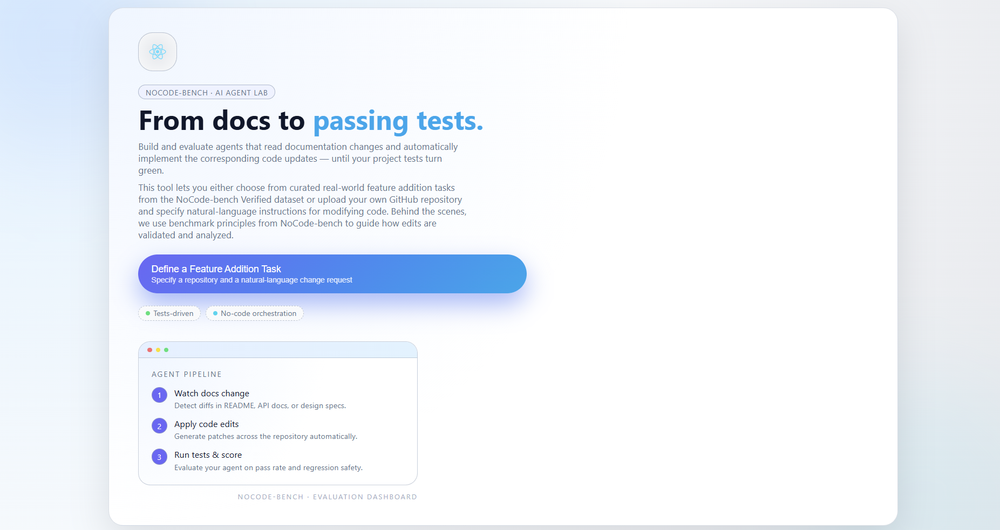
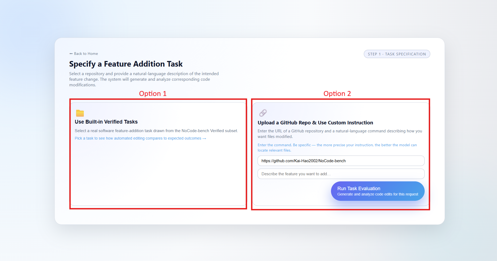
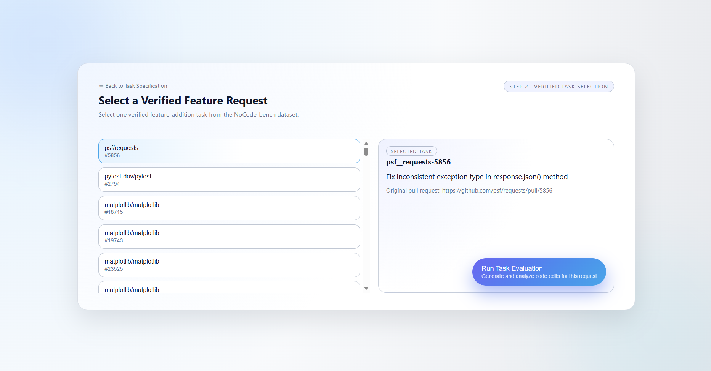

# **User Guide**
> NoCode-bench

<strong>Group:</strong> 7   
<strong>Deployed application:</strong> <a href="https://no-code-bench-frontend.vercel.app/">NoCode-bench app</a>  
<strong>Live Demo:</strong> <a href="https:web...">Click Here</a>  
<strong>GitHub Repository:</strong> <a href="https://github.com/Kai-Hao2002/NoCode-bench">View Repository</a>

---

## **Table of Contents**
1. [Introduction](#introduction)
2. [Platform Overview](#platform-overview)
3. [How the System Works](#platform-overview)
4. [Landing Page and Getting Started](#getting-started)
5. [User roles and Available Features](#key-features)
6. [Typical User Journey](#concrete-example)
7. [Value Proposition and Current Limitations](#limitations)

## 1. Introduction
Software documentation often describes intended feature changes using natural language, yet translating these descriptions into correct code modifications remains challenging. Assessing whether automated systems can reliably perform this translation is important for both software engineering research and practical use.

NoCode-bench addresses this problem by evaluating agents on their ability to implement documented feature requests such that existing project tests pass. This user guide introduces a web-based platform built to support interaction with the NoCode-bench benchmark and to make documentation-driven code evaluation accessible to end users.

The document focuses on explaining the platform’s purpose, capabilities, and usage from a user perspective, without requiring prior knowledge of software engineering or artificial intelligence.

## 2. Platform Overview
The NoCode-bench platform is a browser-based evaluation system for documentation-driven code changes. It allows users to define feature addition tasks, run automated evaluations, and inspect results through a unified web interface.

Users may evaluate agents using either verified benchmark tasks from the NoCode-bench dataset or custom feature requests defined on arbitrary GitHub repositories. The platform handles repository preparation, code modification, and test execution automatically, enabling users to focus on task definition and result interpretation rather than setup or configuration.

## 3. How the System Works
At a high level, the system converts a documentation-based feature request into a tested code update through a fully automated process. Conceptually, the workflow consists of three stages.

First, the system interprets the feature request, which may originate from a verified benchmark task or a user-defined instruction. This request describes the intended behavior change in natural language.

Next, the system generates and applies code edits that aim to implement the requested behavior on a copy of the target repository, preserving the original codebase.

Finally, the system runs the project’s existing test suite to verify correctness. A task is considered successful only if the generated code passes all developer-provided tests, reflecting the core evaluation principle of NoCode-bench.

## 4. Landing Page and Getting Started
The landing page is the primary entry point to the application and provides an immediate overview of the platform’s purpose. It presents the core idea of NoCode-bench–style evaluation and guides users toward defining a feature addition task.

A prominent call-to-action button, **“Define a Feature Addition Task”**, directs users into the task specification workflow. No registration or local setup is required; all interactions take place through the web interface. Visual elements on the page summarize the evaluation pipeline, offering users a high-level understanding of the process before proceeding.

**Figure 1** shows the landing page of the application. 

#### Key Characteristics
- **Single entry point** for all users and workflows
- **Zero setup required**, no local installation or configuration
- **Clear call-to-action** leading directly to task definition
- **Immediate overview** of the agent pipeline and evaluation process

This design ensures that first-time users can quickly grasp the system’s functionality and proceed to defining and evaluating NoCode-bench tasks with minimal friction.

## 5. User roles and Available Features
### 5.1 End User: Task Selection
The task specification page is the first interactive step in the evaluation workflow. It allows end users to define a **feature addition task** by either selecting a curated benchmark instance or providing a custom repository together with natural-language instructions.

As shown in **Figure 2**, the interface presents two alternative task specification modes, enabling both standardized benchmarking and flexible, user-defined evaluation scenarios.

**Figure 2** illustrates the task specification page, highlighting both the built-in task selection option and the custom repository input interface.

#### Option 1: Use Built-in Verified Tasks
Users may choose a predefined feature addition task from the **NoCode-bench Verified** dataset. These tasks are derived from real-world documentation changes and are accompanied by corresponding test suites used for automated evaluation.

Selecting a built-in task requires no additional input. This option is recommended for users who wish to reproduce benchmark results or compare agent performance under standardized conditions.

When users choose the built-in verified task option, they are routed to a dedicated selection page displaying a list of **verified feature requests** from the NoCode-bench dataset.

As shown in **Figure 3**, the left panel presents a scrollable list of available requests, each identified by its repository name and issue or pull request identifier. Selecting a request updates the right panel, which displays detailed information about the chosen task, including:
- The request name
- A brief description of the intended feature change
- A link to the original GitHub issue or pull request

**Figure 3** illustrates the verified task selection page, highlighting the list of available feature requests and the corresponding task details displayed for the selected request.

This layout allows users to inspect task details before execution and ensures transparency regarding the origin and intent of each benchmark instance. Once a task has been selected, users may proceed by clicking the **“Run Task Evaluation”** button to start the automated evaluation process.

#### Option 2: Upload a GitHub Repository with Custom Instructions
Alternatively, users can define a custom task by providing:
- A **GitHub repository URL**
- A **natural-language description** of the intended feature change or documentation update

The instructions describe how the existing codebase should be modified to implement the requested functionality, enabling exploratory evaluation on arbitrary projects beyond the predefined benchmark set.

To ensure valid input, the system performs basic URL validation before allowing task execution. The repository URL must begin with a supported scheme (e.g., `http://` or `https://`). If the input does not meet this requirement, an inline error message is displayed and task execution is disabled. Once a valid repository URL is provided, the natural-language instruction field becomes available, guiding users to complete a well-formed task specification before proceeding.

### 5.2 End User: Evaluation Configuration and Execution

After a task has been specified, users can initiate the evaluation by clicking the **Run Task Evaluation** button. From the user’s perspective, the execution process is fully automated and requires no additional configuration.

Once execution begins, the system prepares the selected repository and constructs the evaluation context based on the provided documentation change or verified task specification. An agent is then invoked to generate code edits that implement the requested feature. These edits are applied to the codebase, after which the project’s existing test suite is executed to validate correctness.

During execution, the interface provides visual feedback indicating the current evaluation status. Users are not required to intervene at any stage of the process. Upon completion, the system records the execution outcome and transitions to the results view, where evaluation metrics and generated code changes are presented.

This execution workflow follows the standard NoCode-bench evaluation protocol, ensuring that generated patches are assessed solely based on whether they satisfy developer-provided tests.

After execution completes, the evaluation results and performance metrics are presented to the user, as described in the following section.

### 5.3 End User: Results and Metrics Visualization

待截圖，待補

## 6. Typical User Journey
This section illustrates a typical end-to-end usage scenario to demonstrate how an end user interacts with the application to evaluate a documentation-driven feature addition using NoCode-bench.

#### Scenario
A user wants to evaluate how well an AI agent can implement a documented feature request using a standardized NoCode-bench task.

#### Steps
1. **Access the application**  
   The user opens the web application and lands on the main page, where the purpose of the platform and the evaluation workflow are presented at a glance.
2. **Define a feature addition task**  
   The user clicks **Define a Feature Addition Task** and chooses to use a built-in verified task from the NoCode-bench dataset. This ensures a standardized evaluation setting.
3. **Select a verified feature request**  
   From the list of available requests, the user selects a feature request and reviews its description and original GitHub source to understand the intended change.
4. **Run task evaluation**  
   The user initiates execution by clicking **Run Task Evaluation**. The system automatically generates code edits, applies them to the repository, and runs the existing test suite without further user intervention.
5. **Review evaluation outcome**  
   After execution completes, the user is presented with the evaluation results, including whether the generated patch passes the tests and relevant performance metrics.

This workflow demonstrates how the application enables users to move from task definition to evaluation results through a streamlined, fully automated process.

## 7. Value Proposition and Current Limitations
| Issue | Recommended Solution |
| :--- | :--- |
| Issue 1| xxxx. |
| Issue 2 | xxxx. |