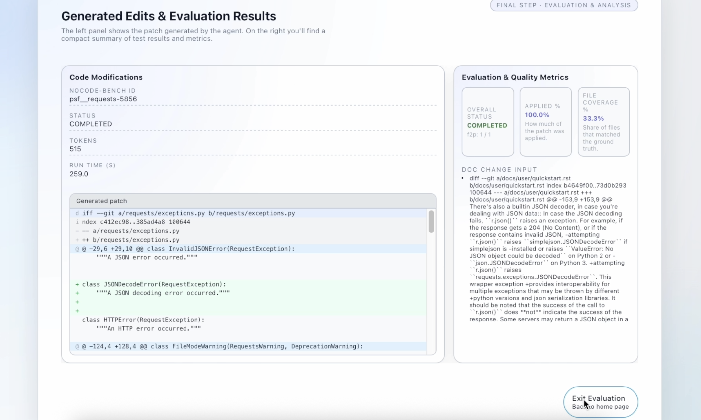

# **User Guide**
> NoCode-bench

<strong>Group:</strong> 7   
<strong>Deployed application:</strong> <a href="https://no-code-bench-frontend.vercel.app/">NoCode-bench app</a>  
<strong>Live Demo:</strong> <a href="https://drive.google.com/file/d/13aviAPQ92us48Hdgfs1HDFL2YAW53mSj/view?usp=sharing">Click Here</a>  
<strong>GitHub Repository:</strong> <a href="https://github.com/Kai-Hao2002/NoCode-bench">View Repository</a>

---

## **Table of Contents**
1. [Introduction](#introduction)
2. [Platform Overview](#platform-overview)
3. [How the System Works](#platform-overview)
4. [Landing Page and Getting Started](#getting-started)
5. [User roles and Available Features](#key-features)
6. [Typical User Journey](#concrete-example)
7. [Value Proposition and Current Limitations](#limitations)

## **1. Introduction**
Software documentation often describes intended feature changes using natural language, yet translating these descriptions into correct code modifications remains challenging. Assessing whether automated systems can reliably perform this translation is important for both software engineering research and practical use.

NoCode-bench addresses this problem by evaluating agents on their ability to implement documented feature requests such that existing project tests pass. This user guide introduces a web-based platform built to support interaction with the NoCode-bench benchmark and to make documentation-driven code evaluation accessible to end users.

The document focuses on explaining the platform’s purpose, capabilities, and usage from a user perspective, without requiring prior knowledge of software engineering or artificial intelligence.

## **2. Platform Overview**
The NoCode-bench platform is a browser-based evaluation system for documentation-driven code changes. It allows users to define feature addition tasks, run automated evaluations, and inspect results through a unified web interface.

Users may evaluate agents using either verified benchmark tasks from the NoCode-bench dataset or custom feature requests defined on arbitrary GitHub repositories. The platform handles repository preparation, code modification, and test execution automatically, enabling users to focus on task definition and result interpretation rather than setup or configuration.

## **3. How the System Works**
At a high level, the system converts a documentation-based feature request into a tested code update through a fully automated process. Conceptually, the workflow consists of three stages.

First, the system interprets the feature request, which may originate from a verified benchmark task or a user-defined instruction. This request describes the intended behavior change in natural language.

Next, the system generates and applies code edits that aim to implement the requested behavior on a copy of the target repository, preserving the original codebase.

Finally, the system runs the project’s existing test suite to verify correctness. A task is considered successful only if the generated code passes all developer-provided tests, reflecting the core evaluation principle of NoCode-bench.

## **4. Landing Page and Getting Started**
The landing page is the primary entry point to the application and provides an immediate overview of the platform’s purpose. It presents the core idea of NoCode-bench–style evaluation and guides users toward defining a feature addition task.

A prominent call-to-action button, **“Define a Feature Addition Task”**, directs users into the task specification workflow. No registration or local setup is required; all interactions take place through the web interface. Visual elements on the page summarize the evaluation pipeline, offering users a high-level understanding of the process before proceeding.

  

**Figure 1** shows the landing page of the application. 

#### Key Characteristics
- **Single entry point** for all users and workflows
- **Zero setup required**, no local installation or configuration
- **Clear call-to-action** leading directly to task definition
- **Immediate overview** of the agent pipeline and evaluation process

This design ensures that first-time users can quickly grasp the system’s functionality and proceed to defining and evaluating NoCode-bench tasks with minimal friction.

## **5. User roles and Available Features**
This section describes the functionality available to end users, covering task specification, execution, and result inspection within the NoCode-bench platform.

### **5.1 End User: Task Selection**
The task specification page is the first interactive step of the evaluation workflow. It allows users to define a **feature addition task** by either selecting a predefined benchmark instance or providing a custom GitHub repository together with natural-language instructions.

As illustrated in **Figure 2**, the interface supports two task specification modes, enabling both standardized benchmarking and flexible, user-defined evaluation.

  

**Figure 2** illustrates the task specification page, highlighting both the built-in task selection option and the custom repository input interface.

#### Option 1: Use Built-in Verified Tasks

Users may select one of the **114 feature requests** from the **NoCode-bench Verified** dataset. These tasks are derived from real-world documentation changes and include corresponding test suites, enabling reproducible and standardized evaluation.

Selecting a verified task routes the user to a dedicated selection page, shown in **Figure 3**, where available requests are listed on the left and detailed task information is displayed on the right, including the request description and original GitHub source.

  

**Figure 3** illustrates the verified task selection page, highlighting the list of available feature requests and the corresponding task details displayed for the selected request.

Once a task has been selected, users can proceed by clicking **Run Task Evaluation** to start execution.

#### Option 2: Upload a GitHub Repository with Custom Instructions

Alternatively, users may define a custom task by providing a **GitHub repository URL** together with a **natural-language description** of the intended feature change or documentation update. This option enables exploratory evaluation on arbitrary projects beyond the predefined benchmark set.

To ensure valid input, the system performs basic URL validation before allowing execution. Invalid URLs disable task execution and trigger an inline error message. Once a valid repository URL is provided, the instruction field becomes available, guiding users to complete a well-formed task specification.

### **5.2 End User: Evaluation Configuration and Execution**
After a task has been specified, users initiate evaluation by clicking **Run Task Evaluation**. From the user’s perspective, the execution process is fully automated and requires no additional configuration.

During execution, the system prepares the selected repository, generates code edits based on the documentation change, applies the patch, and runs the project’s existing test suite. The interface provides visual feedback indicating the current execution status, and no user intervention is required.

This execution workflow follows the standard NoCode-bench evaluation protocol, in which correctness is determined solely by the outcome of developer-provided tests.

### **5.3 End User: Results and Metrics Visualization**
Upon completion, the system presents the evaluation outcome on a dedicated results page that combines **generated code edits** with a **summary of benchmark metrics**.

As shown in **Figure 4**, the left panel displays the patch generated by the agent, enabling users to inspect the concrete code modifications. The right panel reports the evaluation status and quality metrics defined by NoCode-bench, including applied edit percentage, file coverage relative to the reference solution, execution time, and token usage.

  

**Figure 4** illustrates the results page of the application, highlighting the generated code edits, overall evaluation status, and NoCode-bench quality metrics.

In accordance with the benchmark definition, a task is considered successful only if all developer-provided tests pass after the generated patch is applied. By combining test-based validation, quantitative metrics, and code-level inspection, the results view enables clear, reproducible, and interpretable assessment of agent performance.

## **6. Typical User Journey**
This section illustrates a typical end-to-end usage scenario to demonstrate how an end user interacts with the application to evaluate a documentation-driven feature addition using NoCode-bench.

#### Scenario
A user wants to evaluate how well an AI agent can implement a documented feature request using a standardized NoCode-bench task.

#### Steps
1. **Access the application**  
   The user opens the web application and lands on the main page, where the purpose of the platform and the evaluation workflow are presented at a glance.
2. **Define a feature addition task**  
   The user clicks **Define a Feature Addition Task** and chooses to use a built-in verified task from the NoCode-bench dataset. This ensures a standardized evaluation setting.
3. **Select a verified feature request**  
   From the list of available requests, the user selects a feature request and reviews its description and original GitHub source to understand the intended change.
4. **Run task evaluation**  
   The user initiates execution by clicking **Run Task Evaluation**. The system automatically generates code edits, applies them to the repository, and runs the existing test suite without further user intervention.
5. **Review evaluation outcome**  
   After execution completes, the user is presented with the evaluation results, including whether the generated patch passes the tests and relevant performance metrics.

This workflow demonstrates how the application enables users to move from task definition to evaluation results through a streamlined, fully automated process.

## **7. Practical Notes and User-Facing Limitations**

| What you may observe | What it means / What to do |
| :--- | :--- |
| **Code edits may be minimal or appear unchanged** | For some requests, the correct fix can be small, or the agent may fail to identify the correct location. Use **File Coverage** and the patch viewer to confirm what changed. |
| **No evaluation metrics shown for custom repositories** | For custom repository uploads, the **Doc Change Input** panel does not display benchmark metrics. This is expected, as custom repositories do not have predefined ground-truth patches or reference tests required for NoCode-bench metric computation. |
| **Tests fail due to missing imports or dependencies** | The agent may introduce dependencies that are unavailable or import names that do not exist in the current environment, leading to import errors during testing. Consider refining the instruction to avoid new dependencies. |
| **Patch cannot be applied (Applied% failure / apply error)** | Some generated diffs may fail due to **context mismatch** (e.g., incorrect surrounding lines or outdated assumptions). Try rerunning, or choose a different verified task. |
| **Patch applies, but the feature still fails (logic incomplete)** | The code may run but not satisfy feature tests (partial progress). Check the results metrics and patch to understand what was implemented and rerun or refine the request. |
| **Hallucinated functions or APIs** | The generated code may reference non-existent functions or attributes (a known LLM failure mode). Use the patch viewer to spot these quickly and rerun with clearer constraints if needed. |
| **Regression risk: existing behavior may break** | Some runs may over-fix or touch incorrect files, causing previously passing tests to fail. Prefer verified tasks for stable benchmarking; for custom repositories, keep instructions narrow and specific. |