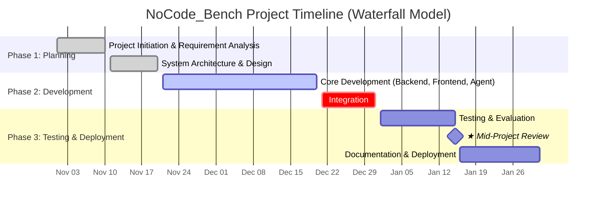

# **Project Management Report**

## **1. Project Timeline & Milestones**
**Project:** NoCode_Bench  
**Start Date:** November 1, 2024  
**End Date:** January 31, 2025  
**Total Duration:** 90 Days  
**Key Milestone:** January 15, 2025 (Mid-Project Review)

| Date | Tasks |
| :--- | :--- |
| 2024.11.01 - 2024.11.10 | Project Initiation & Requirement Analysis |
| 2024.11.11 - 2024.11.20 | System Architecture & Design |
| 2024.11.21 - 2024.12.20 | Core Development - Backend & Frontend & Agent |
| 2024.12.21 - 2024.12.31 | Integration |
| 2025.01.01 - 2025.01.15 | Testing & Evaluation |
| 2025.01.16 - 2025.01.31 | Documentation & Deployment |

## **2. System Architecture**
xxxx.

## **3. Method**
| Component | Choice | Rationale |
| :--- | :--- | :--- |
| design 1 | xxx | xxx. |
| design 2 | xxx| xxxx. |

## **3. Team Roles & Responsibilities**
| Name | Role | Key Contributions |
| :--- | :--- | :--- |
| **Kai-Hao, Yang** | Project Lead & AI Architect | Led the overall project direction and system design; architected and orchestrated agentic workflows across the platform. |
| **Hao Lin** | Backend & Evaluation Engineer | Test and engineered the automated evaluation pipeline. |
| **Han Hu** | Infrastructure & DevOps Engineer | Built Docker sandboxes and automated benchmark environment deployment. |
| **Kaihui, You** | Frontend & UI/UX Designer | Design and implement UI components and page layouts, Handle styling and responsive design. |
| **Hsuan Lien** | Frontend & API Integration Engineer | Integrate frontend with backend APIs, Handle routing, and error handling. |

## **4. Current Progress and Future Plans**
