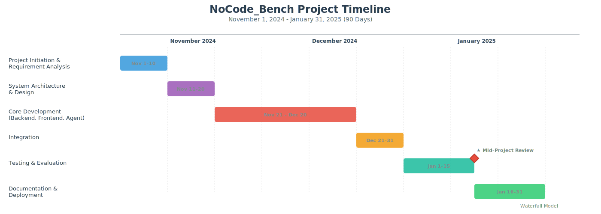

# **Project Management Report**

## **1. Project Timeline & Milestones**
**Project:** NoCode_Bench  
**Start Date:** November 1, 2025  
**End Date:** January 31, 2026  
**Total Duration:** 90 Days   
**Key Milestone:** January 15, 2026 (Mid-Project Review)

| Date | Tasks |
| :--- | :--- |
| 2025.11.01 - 2025.11.10 | Project Initiation & Requirement Analysis |
| 2025.11.11 - 2025.11.20 | System Architecture & Design |
| 2025.11.21 - 2025.12.20 | Core Development - Backend & Frontend & Agent |
| 2025.12.21 - 2025.12.31 | Integration |
| 2026.01.01 - 2026.01.15 | Testing & Evaluation |
| 2026.01.16 - 2026.01.31 | Documentation & Deployment |

## **2. System Architecture**

The NoCode-bench system is built on a distributed, asynchronous architecture designed to handle documentation-driven code generation and containerized validation. The architecture consists of four primary layers:

* **Web & API Layer**: A Django-based backend provides RESTful endpoints for task specification, allowing users to submit either verified benchmark tasks or custom GitHub repository URLs.
* **Task Orchestration Layer**: Utilizes Celery with a Redis message broker to manage long-running evaluation tasks asynchronously. This ensures the web interface remains responsive while the agent processes complex code changes.
* **AI Agent Core**: This component integrates the Gemini-2.5-Flash model for efficient file retrieval and the Gemini-2.5-Pro model for sophisticated code generation. It manages a self-correction loop by maintaining a history of failed attempts and error logs to refine subsequent code patches.
* **Isolated Execution Layer**: A Docker-based environment where generated patches are applied to cloned repositories. It executes pre-configured test suites (Fail-to-Pass and Pass-to-Pass) within specialized containers to verify the functional correctness of the AI-generated code.

## **3. Method**
| Component | Choice | Rationale |
| :--- | :--- | :--- |
| **File Retrieval** | LLM-based Semantic Filtering (Gemini-2.5-Flash) with Path Scanning | Uses high-speed LLM reasoning to identify core files from a large codebase (up to 3000 paths) before fetching full content, ensuring the context remains relevant and within token limits. |
| **Code Generation** | Full-file Rewrite Strategy via Gemini-2.5-Pro | Avoids the complexities of parsing diffs by generating entire file contents with structured delimiters, ensuring code consistency and easier application to the workspace. |
| **Docker Validation** | Isolated Containerized Testing (F2P & P2P) | Provides a reproducible and safe environment to verify patches by running existing tests (Pass-to-Pass) and new feature tests (Fail-to-Pass) to ensure functional correctness without regressions. |
| **Self-Correction Loop** | Iterative Error-Feedback Loop (Attempt-based) | Captures execution failures and test logs to feed back into the model's context, allowing the agent to analyze logic errors and refine its implementation in subsequent attempts. |

## **3. Team Roles & Responsibilities**
| Name | Role | Key Contributions |
| :--- | :--- | :--- |
| **Kai-Hao, Yang** | Project Lead & AI Architect | Led the overall project direction and system design; architected and orchestrated agentic workflows across the platform. |
| **Hao Lin** | Backend & Evaluation Engineer | Test and engineered the automated evaluation pipeline. |
| **Han Hu** | Infrastructure & DevOps Engineer | Built Docker sandboxes and automated benchmark environment deployment. |
| **Kaihui, You** | Frontend & UI/UX Designer | Design and implement UI components and page layouts, Handle styling and responsive design. |
| **Hsuan Lien** | Frontend & API Integration Engineer | Integrate frontend with backend APIs, Handle routing, and error handling. |

## **4. Current Progress and Future Plans**
